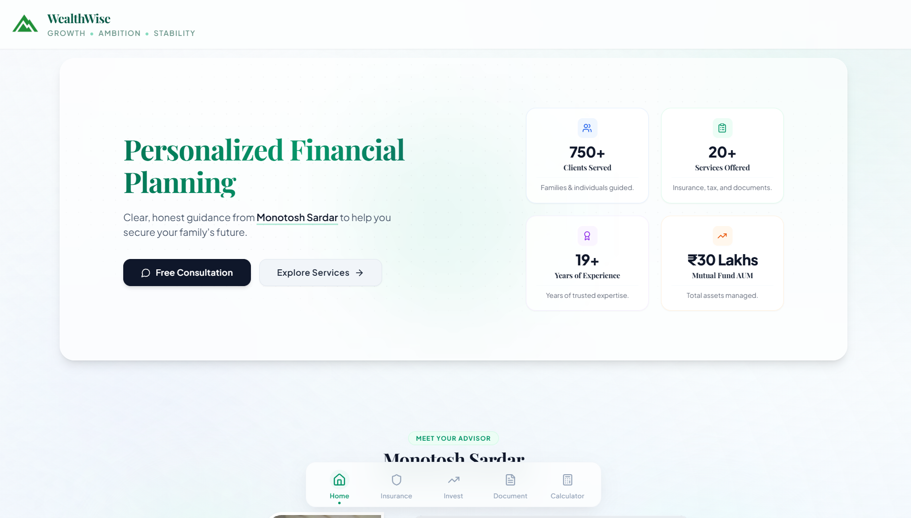

#  WealthWise

A portfolio landing page and financial planning tool for a Certified Financial Planner (CFP). It features interactive calculators, service lists, and a direct WhatsApp contact funnel.



## 💡 Key Features

*   **Financial Calculators**: Tools to calculate SIP, Lumpsum, SWP, Retirement, Child Education, and Marriage planning.
*   **Service Catalogs**: Organized guides for local mutual funds, insurance packages, and identity/tax document services.
*   **Easy Customization**: All contact information, logos, and WhatsApp messages can be changed via environment variables.
*   **Math Testing**: Automated unit tests that verify all calculations.

## 🛠️ Tech Stack

*   **Framework**: Next.js 15 (App Router), React 18
*   **Styling**: Tailwind CSS, CSS Variables
*   **Components & Icons**: Radix UI, Lucide Icons
*   **Language & Tooling**: TypeScript, ESLint
*   **AI Tools**: GitHub Copilot, Antigravity

## 🚀 Quick Start

### 1. Install Dependencies
```bash
npm install
```

### 2. Set Up Environment Variables
Copy `.env.example` to a new `.env` file and enter the advisor's details:
```bash
cp .env.example .env
```
*Note: If these variables are not set, the app will automatically default to the original client's details.*

### 3. Run Locally
```bash
npm run dev
```
Open [http://localhost:3000](http://localhost:3000) to view the website.

## ⚙️ Commands

*   `npm run dev` — Starts the local development server.
*   `npm run build` — Compiles and builds the production app.
*   `npm test` — Runs all unit tests.
*   `npm run lint` — Runs static code checks.

## 📂 Project Structure

*   `app/` — Next.js page routes and global styles.
*   `components/` — UI components and main landing sections.
*   `lib/` — Financial calculators and core helper functions.
*   `tests/` — Test suites validating mathematical formulas.
